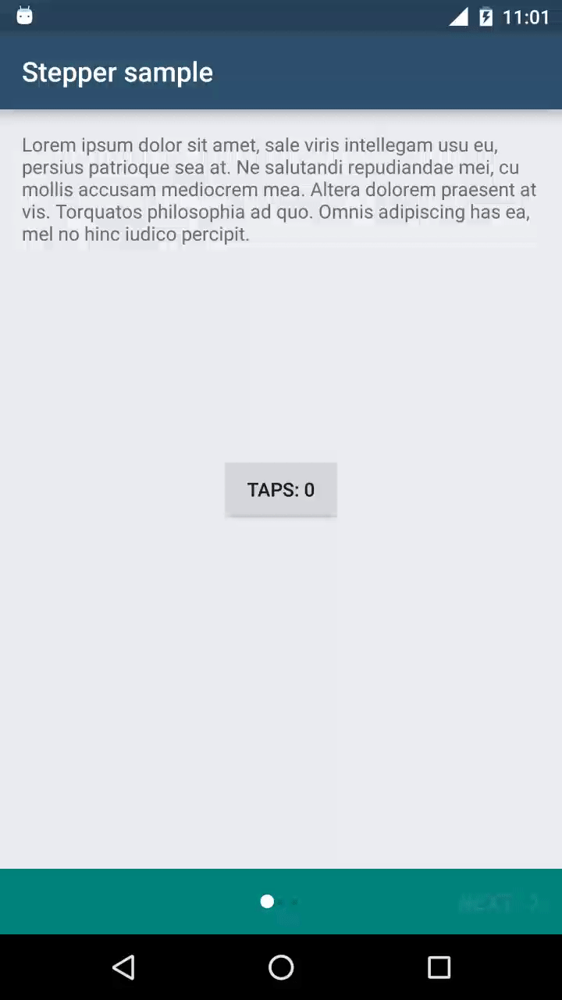
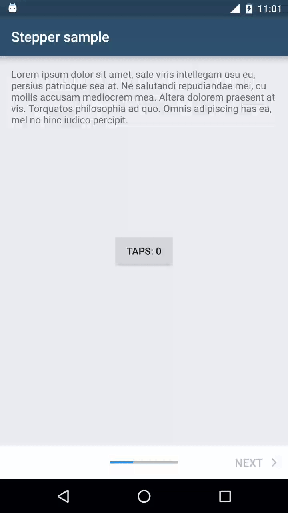
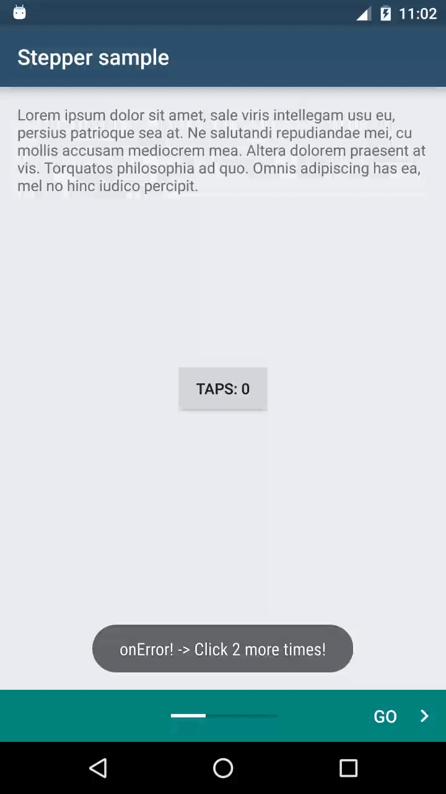
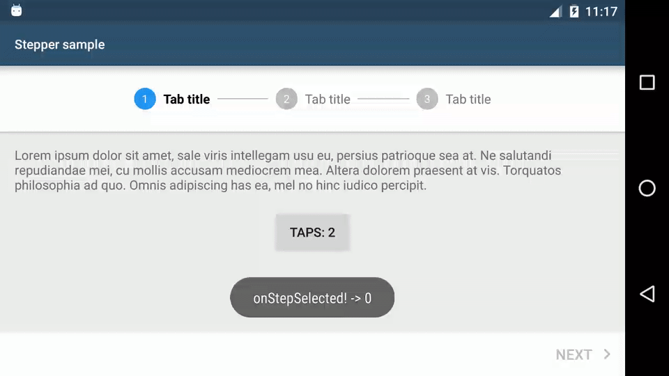
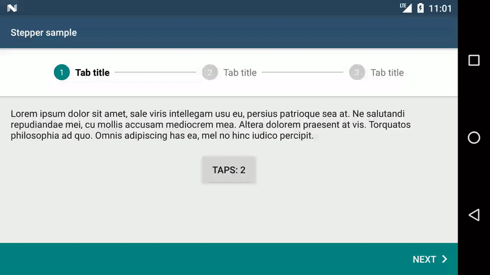
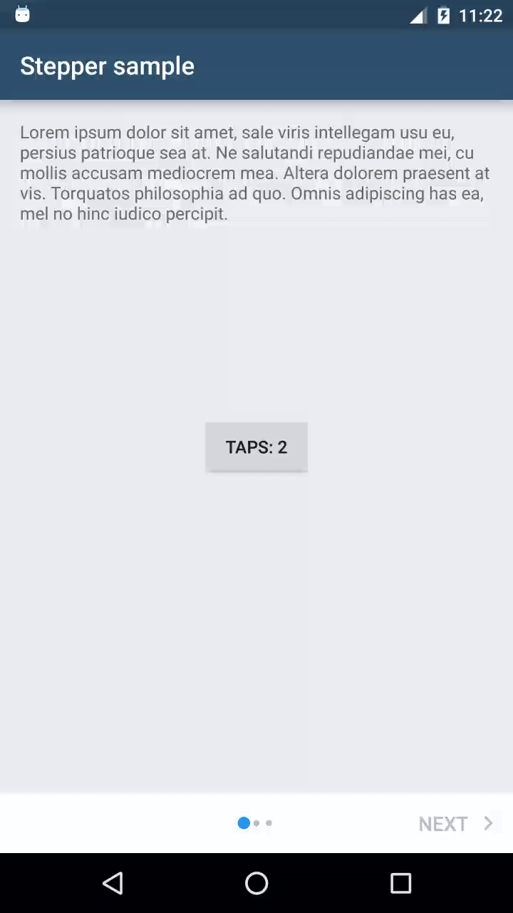

<p align="center">
  
</p>
# Android Material Stepper

This library allows to use Material steppers inside Android applications.

Quoting the [documentation](https://www.google.com/design/spec/components/steppers.html):

>Steppers display progress through a sequence by breaking it up into multiple logical and numbered steps.

## Download (from JCenter)
```groovy
compile 'com.stepstone.stepper:material-stepper:2.0.0'
```

## Supported steppers
  - Mobile stepper with dots <br/>
&nbsp;&nbsp;
  - Mobile stepper with progress bar <br/>
&nbsp;&nbsp;
  - Horizontal stepper <br/>



## Supported features
  - color customisation of individual widgets inside of the stepper via View attributes or a style from a theme
  - custom texts of individual widgets inside of the stepper via View attributes or a style from a theme
  - embedding the stepper anywhere in the view hierarchy and changing the stepper type for various device configurations, e.g. phone/tablet, portrait/landscape
  - step validation
  
## Getting started

### Create layout in XML

```xml
<?xml version="1.0" encoding="utf-8"?>
<com.stepstone.stepper.StepperLayout xmlns:android="http://schemas.android.com/apk/res/android"
    xmlns:app="http://schemas.android.com/apk/res-auto"
    android:id="@+id/stepperLayout"
    android:layout_width="match_parent"
    android:layout_height="match_parent"
    android:orientation="vertical"
    app:ms_stepperType="progress_bar" />
```

For a complete list of StepperLayout attributes see [StepperLayout attributes](#StepperLayout attributes).

### Create step Fragment(s)
Step fragments must extend [android.support.v4.app.Fragment](http://developer.android.com/reference/android/support/v4/app/Fragment.html)
and implement `com.stepstone.stepper.Step`

```java
public class StepFragmentSample extends Fragment implements Step {

    @Override
    public View onCreateView(LayoutInflater inflater, ViewGroup container, Bundle savedInstanceState) {
        View v = inflater.inflate(R.layout.step, container, false);

        //initialize your UI

        return v;
    }

    @Override
    public VerificationError verifyStep() {
        //return null if the user can go to the next step, create a new VerificationError instance otherwise
        return null;
    }

    @Override
    public void onSelected() {
        //update UI when selected
    }

    @Override
    public void onError(@NonNull VerificationError error) {
        //handle error inside of the fragment, e.g. show error on EditText
    }
    
}
```

### Extend AbstractFragmentStepAdapter
AbstractFragmentStepAdapter extends [FragmentPagerAdapter](http://developer.android.com/reference/android/support/v4/app/FragmentPagerAdapter.html)
but instead of overriding the method `getItem(int)` you must override the `createStep(int)` method.

```java
public static class MyStepperAdapter extends AbstractFragmentStepAdapter {

    public MyStepperAdapter(FragmentManager fm, Context context) {
        super(fm, context);
    }

    @Override
    public Fragment createStep(int position) {
        final StepFragmentSample step = new StepFragmentSample();
        Bundle b = new Bundle();
        b.putInt(CURRENT_STEP_POSITION_KEY, position);
        step.setArguments(b);
        return step;
    }

    @Override
    public int getCount() {
        return 3;
    }
}

```

### Set adapter in Activity

```java
public class StepperActivity extends AppCompatActivity {

    private StepperLayout mStepperLayout;

    @Override
    protected void onCreate(Bundle savedInstanceState) {
        super.onCreate(savedInstanceState);
        setContentView(R.layout.main);
        mStepperLayout = (StepperLayout) findViewById(R.id.stepperLayout);
        mStepperLayout.setAdapter(new MyStepperAdapter(getSupportFragmentManager(), this));
    }
}
```

### Add a StepperListener in the Activity (optional)
```java
public class StepperActivity extends AppCompatActivity implements StepperLayout.StepperListener {

    @Override
    protected void onCreate(Bundle savedInstanceState) {
        //...
        mStepperLayout.setListener(this);
    }

    @Override
    public void onCompleted(View completeButton) {
        Toast.makeText(this, "onCompleted!", Toast.LENGTH_SHORT).show();
    }

    @Override
    public void onError(VerificationError verificationError) {
        Toast.makeText(this, "onError! -> " + verificationError.getErrorMessage(), Toast.LENGTH_SHORT).show();
    }

    @Override
    public void onStepSelected(int newStepPosition) {
        Toast.makeText(this, "onStepSelected! -> " + newStepPosition, Toast.LENGTH_SHORT).show();
    }

    @Override
    public void onReturn() {
        finish();
    }

}
```

### Change Next/Complete button's text color when going to the next step should be disabled (optional)
It is possible to change the Next/Complete button's text color (together with right chevron's color)
when all the criteria to go to the next step are not met. This color should indicate that
the user cannot go to next step yet and look as if disabled. Clicking on the button will still perform the regular
step verification. There is a custom state added since setting `android:state_enabled` to `false` in a color selector would disable the clicks
and we want to have them so that we can show an info message for the user.
In order to set that color:

1. Create a new color selector in `res/color`
    
    ```xml
    <?xml version="1.0" encoding="utf-8"?>
    <selector xmlns:android="http://schemas.android.com/apk/res/android" xmlns:app="http://schemas.android.com/apk/res-auto">
        <item app:state_verification_failed="true" android:color="#30BDBDBD"/>
        <item android:color="@color/ms_white"/>
    </selector>
    ```
2. Change button's (text) color in layout file
    
    ```xml
    <?xml version="1.0" encoding="utf-8"?>
    <com.stepstone.stepper.StepperLayout xmlns:android="http://schemas.android.com/apk/res/android"
        xmlns:app="http://schemas.android.com/apk/res-auto"
        android:id="@+id/stepperLayout"
        android:layout_width="match_parent"
        android:layout_height="match_parent"
        app:ms_stepperType="dots"
        app:ms_nextButtonColor="@color/ms_custom_button_text_color"
        app:ms_completeButtonColor="@color/ms_custom_button_text_color" />
    ```
3. Toggle the state in code
    
    ```java
    mStepperLayout.setNextButtonVerificationFailed(!enabled);
    mStepperLayout.setCompleteButtonVerificationFailed(!enabled);
    ```

### Make an IO operation before going to the next step (optional)
If the user wants to e.g. save something in the database or make a network call on a separate Thread after clicking on the Next button
he can perform these operations and then invoke the `goToNextStep()` method of the `StepperLayout.OnNextClickedCallback` in the current Step.
While operations are performed, and the user would like to go back you can cancel them and then invoke `onBackClicked()` method of the `StepperLayout.OnBackClickedCallback`.
<p></p>
The fragment must implement `BlockingStep` instead of `Step`.
Also, make sure that `goToNextStep()` gets called on the main thread.
**Note:** the `onNextClicked(StepperLayout.OnNextClickedCallback)` method gets invoked after step verification.
E.g.:
```java
public class DelayedTransitionStepFragmentSample extends Fragment implements BlockingStep {

    //...

    @Override
    @UiThread
    public void onNextClicked(final StepperLayout.OnNextClickedCallback callback) {
        new Handler().postDelayed(new Runnable() {
            @Override
            public void run() {
                callback.goToNextStep();
            }
        }, 2000L);
    }

    @Override
    @UiThread
    public void onBackClicked(StepperLayout.OnBackClickedCallback callback) {
        Toast.makeText(this.getContext(), "Your custom back action. Here you should cancel currently running operations", Toast.LENGTH_SHORT).show();
        callback.goToPrevStep();
     }

}
```

### Changing the Next button text per step
<b>TODO update + add tutorial for Back button</b>
Sometimes you might want to have different labels on the Next button on different steps e.g. use the default label on the first few steps,
but display 'Summary' just before the last page.
<p></p>
In such case you need to override the `getNextButtonText(int)` method in the `AbstractStepAdapter` e.g.
```java
        @StringRes
        @Override
        public int getNextButtonText(int position) {
            switch (position) {
                case 0:
                    return R.string.ms_next;
                case 1:
                    return R.string.go_to_summary;
                default:
                    throw new IllegalArgumentException("Unsupported position: " + position);
            }
        }
```

### Using the same stepper styling across the application
If you have many steppers in your application in different activities/fragments you might want to set a common style in a theme.
To do so, you need to set the `ms_stepperStyle` attribute in the theme, e.g.
```xml
    <style name="AppTheme" parent="Theme.AppCompat.Light.DarkActionBar">
        ...
        
        <item name="ms_stepperStyle">@style/DotStepperStyle</item>
    </style>
```
and declare that style in the XML you keep your styles at, e.g.
```xml
    <style name="DotStepperStyle">
        <item name="ms_stepperType">dots</item>
        <item name="ms_activeStepColor">#FFFFFF</item>
        <item name="ms_inactiveStepColor">#006867</item>
        <item name="ms_bottomNavigationBackground">?attr/colorAccent</item>
    </style>
```

### Showing a Back button on first step
By default if the user is on the first step then the Back button in the bottom navigation is hidden. 
This behaviour can be changed by setting ```ms_showBackButtonOnFirstStep``` to ```true```, e.g.
```xml
    <?xml version="1.0" encoding="utf-8"?>
    <com.stepstone.stepper.StepperLayout xmlns:android="http://schemas.android.com/apk/res/android"
        xmlns:app="http://schemas.android.com/apk/res-auto"
        android:id="@+id/stepperLayout"
        android:layout_width="match_parent"
        android:layout_height="match_parent"
        app:ms_showBackButtonOnFirstStep="true"
        app:ms_stepperType="dots" />
```
To get a callback when this button was pressed you need set a ```StepperListener``` and write your own custom return logic in the ```onReturn()``` method to e.g. close the Activity.

### Using with Views instead of Fragments
<b>TODO: document</b>

### Advanced usage
For other examples, e.g. persisting state on rotation, displaying errors, changing whether the user can go to the next step, etc. check out the sample app.

## StepperLayout attributes
| Attribute name                  | Format                                    | Description |
| --------------------------------|-------------------------------------------|-------------|
| *ms_stepperType*                | one of `dots`, `progress_bar` or `tabs`   | **REQUIRED:** Type of the stepper |
| *ms_backButtonColor*            | color or reference                        | BACK button's text color           |
| *ms_nextButtonColor*            | color or reference                        | NEXT button's text color            |
| *ms_completeButtonColor*        | color or reference                        | COMPLETE button's text color            |
| *ms_activeStepColor*            | color or reference                        | Active step's color            |
| *ms_inactiveStepColor*          | color or reference                        | Inactive step's color            |
| *ms_bottomNavigationBackground* | reference                                 | Background of the bottom navigation            |
| *ms_backButtonBackground*       | reference                                 | BACK button's background            |
| *ms_nextButtonBackground*       | reference                                 | NEXT button's background            |
| *ms_completeButtonBackground*   | reference                                 | COMPLETE button's background            |
| *ms_backButtonText*             | string or reference                       | BACK button's text            |
| *ms_nextButtonText*             | string or reference                       | NEXT button's text            |
| *ms_completeButtonText*         | string or reference                       | COMPLETE button's text            |
| *ms_tabStepDividerWidth*        | dimension or reference                    | The width of the horizontal tab divider used in tabs stepper type            |
| *ms_showBackButtonOnFirstStep*  | boolean                                   | Flag indicating if the Back (Previous step) button should be shown on the first step. False by default.            |

## Missing features
  - support for non-linear steppers
  - support for non-editable steppers
  - support for Alternative labels in the horizontal stepper
  
## License
Copyright 2016 StepStone Services
    
Licensed under the Apache License, Version 2.0 (the "License");
you may not use this file except in compliance with the License.
You may obtain a copy of the License at
    
&nbsp;&nbsp;&nbsp;&nbsp;[http://www.apache.org/licenses/LICENSE-2.0](http://www.apache.org/licenses/LICENSE-2.0)
    
Unless required by applicable law or agreed to in writing, software
distributed under the License is distributed on an "AS IS" BASIS,
WITHOUT WARRANTIES OR CONDITIONS OF ANY KIND, either express or implied.
See the License for the specific language governing permissions and
limitations under the License.

## Maintained by
<a href="http://www.stepstone.com"></a>