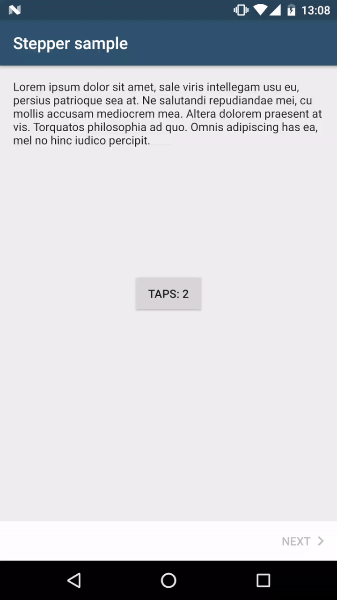
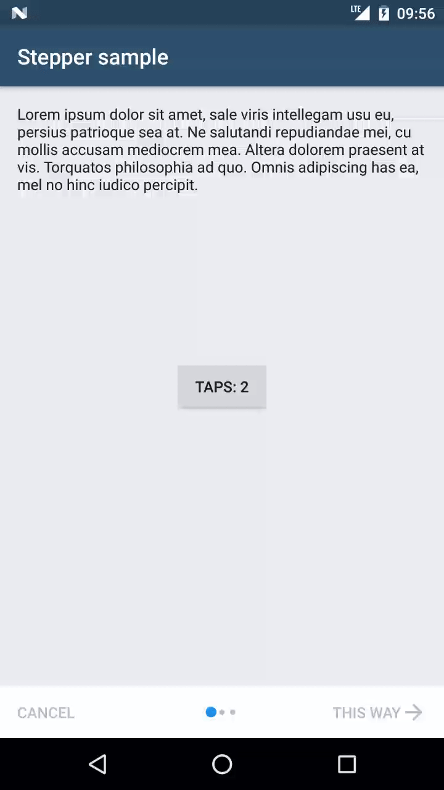
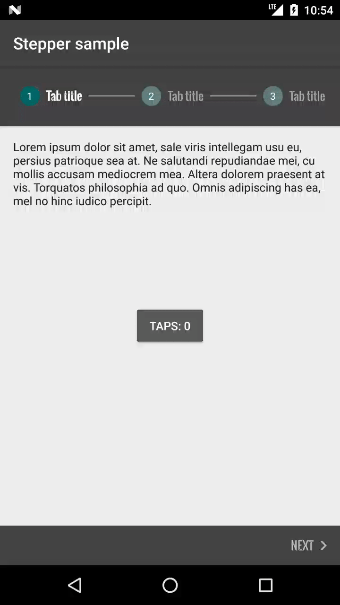
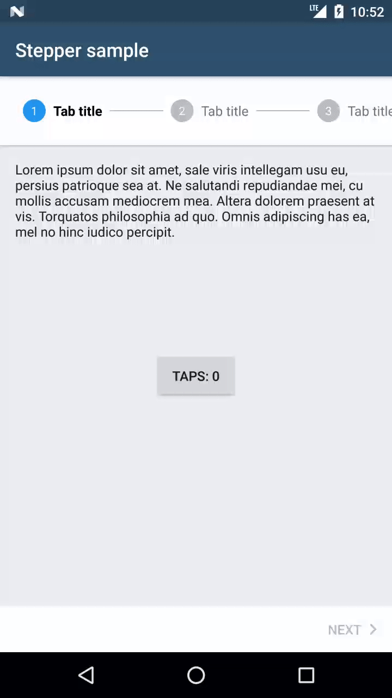
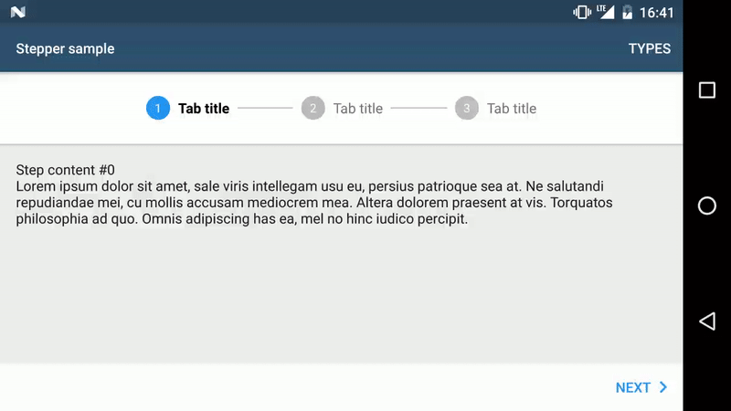

<p align="center">
  
</p>

# Android Material Stepper [](https://circleci.com/gh/stepstone-tech/android-material-stepper) [](https://codecov.io/gh/stepstone-tech/android-material-stepper) [](https://android-arsenal.com/details/1/5138) [](http://androidweekly.net/issues/issue-243)

This library allows to use Material steppers inside Android applications.

Quoting the [documentation](https://www.google.com/design/spec/components/steppers.html):

>Steppers display progress through a sequence by breaking it up into multiple logical and numbered steps.

All of the code & features mentioned in [Getting started](#getting-started) and [Advanced usage](#advanced-usage) are showcased in the sample app.
Moreover, you can find there other examples, e.g. how to persist state on rotation, display errors, change whether the user can go to the next step, etc. So please have a look!

## Jump to section
- [Supported steppers](#supported-steppers)
- [Supported features](#supported-features)
- [Getting started](#getting-started)
- [Advanced usage](#advanced-usage)
  - [Making extra operations before going to the next step](#making-extra-operations-before-going-to-the-next-step)
  - [Changing button labels & compound drawables per step](#changing-button-labels--compound-drawables-per-step)
  - [Subtitles in tabs](#subtitles-in-tabs)
  - [Custom styling](#custom-styling)
  - [Using same stepper styling across the application](#using-same-stepper-styling-across-the-application)
  - [Showing a Back button on first step](#showing-a-back-button-on-first-step)
  - [Using Views instead of Fragments as Steps](#using-views-instead-of-fragments-as-steps)
  - [Showing an error on tabs if step verification failed](#showing-an-error-on-tabs-if-step-verification-failed)
  - [Stepper feedback](#stepper-feedback)
  - [Changing button text color when going to the next step should be disabled](#changing-button-text-color-when-going-to-the-next-step-should-be-disabled)
  - [Hiding bottom navigation bar](#hiding-bottom-navigation-bar)
- [StepperLayout attributes](#stepperlayout-attributes)
	- [View attributes](#view-attributes)
	- [StepperLayout style attributes](#stepperlayout-style-attributes)
- [Changelog](#changelog)
- [Espresso tests](#espresso-tests)
- [Contributing](#contributing)
- [License](#license)

## Supported steppers

### Mobile stepper with dots <br/>
&nbsp;&nbsp;

### Mobile stepper with progress bar <br/>
&nbsp;&nbsp;

### Mobile stepper without a progress indicator <br/>


### Horizontal stepper <br/>


## Supported features
  - color customisation of individual widgets inside of the stepper via View attributes or a style from a theme
  - custom texts of individual widgets inside of the stepper via View attributes or a style from a theme
  - embedding the stepper anywhere in the view hierarchy and changing the stepper type for various device configurations, e.g. phone/tablet, portrait/landscape
  - step validation
  - use with Fragments or Views
  - showing errors in tabs
  - showing stepper feedback for ongoing operations (see [Stepper feedback](https://material.io/guidelines/components/steppers.html#steppers-types-of-steppers))
  
## Getting started

### Download (from JCenter)
```groovy
compile 'com.stepstone.stepper:material-stepper:4.3.1'
```

*Note:* This library adds a transitive dependency to AppCompat `25.4.0`
which is the minimum Android Support library version compatible with the Stepper library.

### Create layout in XML

```xml
<?xml version="1.0" encoding="utf-8"?>
<com.stepstone.stepper.StepperLayout xmlns:android="http://schemas.android.com/apk/res/android"
    xmlns:app="http://schemas.android.com/apk/res-auto"
    android:id="@+id/stepperLayout"
    android:layout_width="match_parent"
    android:layout_height="match_parent"
    app:ms_stepperType="progress_bar" />
```

For a complete list of StepperLayout attributes see [StepperLayout attributes](#StepperLayout attributes).

### Create step Fragment(s)
Step fragments must extend [android.support.v4.app.Fragment](http://developer.android.com/reference/android/support/v4/app/Fragment.html)
and implement `com.stepstone.stepper.Step`

```java
public class StepFragmentSample extends Fragment implements Step {

    @Override
    public View onCreateView(LayoutInflater inflater, ViewGroup container, Bundle savedInstanceState) {
        View v = inflater.inflate(R.layout.step, container, false);

        //initialize your UI

        return v;
    }

    @Override
    public VerificationError verifyStep() {
        //return null if the user can go to the next step, create a new VerificationError instance otherwise
        return null;
    }

    @Override
    public void onSelected() {
        //update UI when selected
    }

    @Override
    public void onError(@NonNull VerificationError error) {
        //handle error inside of the fragment, e.g. show error on EditText
    }
    
}
```

### Extend AbstractFragmentStepAdapter
AbstractFragmentStepAdapter extends [FragmentPagerAdapter](http://developer.android.com/reference/android/support/v4/app/FragmentPagerAdapter.html)
but instead of overriding the method `getItem(int)` you must override the `createStep(int)` method.

```java
public static class MyStepperAdapter extends AbstractFragmentStepAdapter {

    public MyStepperAdapter(FragmentManager fm, Context context) {
        super(fm, context);
    }

    @Override
    public Step createStep(int position) {
        final StepFragmentSample step = new StepFragmentSample();
        Bundle b = new Bundle();
        b.putInt(CURRENT_STEP_POSITION_KEY, position);
        step.setArguments(b);
        return step;
    }

    @Override
    public int getCount() {
        return 3;
    }

    @NonNull
    @Override
    public StepViewModel getViewModel(@IntRange(from = 0) int position) {
        //Override this method to set Step title for the Tabs, not necessary for other stepper types
        return new StepViewModel.Builder(context)
                .setTitle(R.string.tab_title) //can be a CharSequence instead
                .create();
    }
}

```

### Set adapter in Activity

```java
public class StepperActivity extends AppCompatActivity {

    private StepperLayout mStepperLayout;

    @Override
    protected void onCreate(Bundle savedInstanceState) {
        super.onCreate(savedInstanceState);
        setContentView(R.layout.main);
        mStepperLayout = (StepperLayout) findViewById(R.id.stepperLayout);
        mStepperLayout.setAdapter(new MyStepperAdapter(getSupportFragmentManager(), this));
    }
}
```

### Add a StepperListener in the Activity (optional)
```java
public class StepperActivity extends AppCompatActivity implements StepperLayout.StepperListener {

    @Override
    protected void onCreate(Bundle savedInstanceState) {
        //...
        mStepperLayout.setListener(this);
    }

    @Override
    public void onCompleted(View completeButton) {
        Toast.makeText(this, "onCompleted!", Toast.LENGTH_SHORT).show();
    }

    @Override
    public void onError(VerificationError verificationError) {
        Toast.makeText(this, "onError! -> " + verificationError.getErrorMessage(), Toast.LENGTH_SHORT).show();
    }

    @Override
    public void onStepSelected(int newStepPosition) {
        Toast.makeText(this, "onStepSelected! -> " + newStepPosition, Toast.LENGTH_SHORT).show();
    }

    @Override
    public void onReturn() {
        finish();
    }

}
```

## Advanced usage

### Making extra operations before going to the next step
After clicking on the Next button if the user wants to e.g.:
* save something in the database
* make a network call on a separate Thread
* simply save the data from the current step to some other component or parent Activity (see 'Passing data between steps' in the sample app for more details)

he can perform these operations and then invoke the `goToNextStep()` method of the `StepperLayout.OnNextClickedCallback` in the current Step.
If the user wants to perform these operations on the final step, when clicking on the Complete button, he needs to invoke the `complete()` method of the  `StepperLayout.OnCompleteClickedCallback`.
While operations are performed, and the user would like to go back you can cancel them and then invoke `onBackClicked()` method of the `StepperLayout.OnBackClickedCallback`.
<p></p>

To do so the fragment/view must implement `BlockingStep` instead of `Step`.
Also, make sure that `goToNextStep()` and/or `complete()` get called on the main thread.
**Note:** `onNextClicked(StepperLayout.OnNextClickedCallback)` and ``onCompleteClicked(StepperLayout.OnCompleteClickedCallback)`` methods get invoked after step verification.
E.g.:

```java
public class DelayedTransitionStepFragmentSample extends Fragment implements BlockingStep {

    //...

    @Override
    @UiThread
    public void onNextClicked(final StepperLayout.OnNextClickedCallback callback) {
        new Handler().postDelayed(new Runnable() {
            @Override
            public void run() {
                callback.goToNextStep();
            }
        }, 2000L);
    }

    @Override
    @UiThread
    public void onCompleteClicked(final StepperLayout.OnCompleteClickedCallback callback) {
        new Handler().postDelayed(new Runnable() {
            @Override
            public void run() {
                callback.complete();
            }
        }, 2000L);
    }

    @Override
    @UiThread
    public void onBackClicked(StepperLayout.OnBackClickedCallback callback) {
        Toast.makeText(this.getContext(), "Your custom back action. Here you should cancel currently running operations", Toast.LENGTH_SHORT).show();
        callback.goToPrevStep();
     }

}
```

### Changing button labels & compound drawables per step
Sometimes you might want to have different labels on the Next/Complete and/or Back navigation buttons on different steps e.g. use the default labels on the first few steps,
but display 'Summary' just before the last page.
You might also want to use your custom icons instead of the default navigation button compound drawables or not show the compound drawables for some of the buttons.
<p></p>
In such case you need to override the `getViewModel(int)` method from the `StepAdapter` e.g.

```java
    @NonNull
    @Override
    public StepViewModel getViewModel(@IntRange(from = 0) int position) {
        StepViewModel.Builder builder = new StepViewModel.Builder(context)
                .setTitle(R.string.tab_title);
        switch (position) {
            case 0:
                builder
                    .setEndButtonLabel("This way")
                    .setBackButtonLabel("Cancel")
                    .setNextButtonEndDrawableResId(R.drawable.ms_forward_arrow)
                    .setBackButtonStartDrawableResId(StepViewModel.NULL_DRAWABLE);
                break;
            case 1:
                builder
                    .setEndButtonLabel(R.string.go_to_summary)
                    .setBackButtonLabel("Go to first")
                    .setBackButtonStartDrawableResId(R.drawable.ms_back_arrow);
                break;
            case 2:
                builder
                    .setBackButtonLabel("Go back")
                    .setEndButtonLabel("I'm done!");
                break;
            default:
                throw new IllegalArgumentException("Unsupported position: " + position);
        }
        return builder.create();
    }
```

It is also possible to hide Back/Next/Complete buttons on each step if needed.
To do so you need to call `setBackButtonVisible(false)` and/or `setEndButtonVisible(false)` on
`StepViewModel.Builder` in your adapter.

### Subtitles in tabs
You can set a subtitle for each step in stepper with tabs, e.g. to mark a step as optional.
To do so you need to set the subtitle by calling `StepViewModel.Builder#setSubtitle(int)` or `StepViewModel.Builder#setSubtitle(CharSequence)`
in your adapter's `getViewModel` method.

### Custom styling
Basic styling can be done by choosing the active and inactive step colors. 
There are some additional properties which can be changed directly from StepperLayout's attributes e.g. the background of bottom navigation buttons (see [StepperLayout attributes](#stepperlayout-attributes))
For advanced styling you can use `ms_stepperLayoutTheme` StepperLayout's attribute and provide your custom style to be used.
See 'Custom StepperLayout theme' in the sample app for an example.
<p></p>

### Using same stepper styling across the application
If you have many steppers in your application in different activities/fragments you might want to set a common style in a theme.
To do so, you need to set the `ms_stepperStyle` attribute in the theme, e.g.
```xml
    <style name="AppTheme" parent="Theme.AppCompat.Light.DarkActionBar">
        ...
        
        <item name="ms_stepperStyle">@style/DotStepperStyle</item>
    </style>
```
and declare that style in the XML you keep your styles at, e.g.
```xml
    <style name="DotStepperStyle">
        <item name="ms_stepperType">dots</item>
        <item name="ms_activeStepColor">#FFFFFF</item>
        <item name="ms_inactiveStepColor">#006867</item>
        <item name="ms_bottomNavigationBackground">?attr/colorAccent</item>
    </style>
```

### Showing a Back button on first step
By default if the user is on the first step then the Back button in the bottom navigation is hidden. 
This behaviour can be changed by setting ```ms_showBackButtonOnFirstStep``` to ```true```, e.g.
```xml
    <?xml version="1.0" encoding="utf-8"?>
    <com.stepstone.stepper.StepperLayout xmlns:android="http://schemas.android.com/apk/res/android"
        xmlns:app="http://schemas.android.com/apk/res-auto"
        android:id="@+id/stepperLayout"
        android:layout_width="match_parent"
        android:layout_height="match_parent"
        app:ms_showBackButtonOnFirstStep="true"
        app:ms_stepperType="dots" />
```
To get a callback when this button was pressed you need set a ```StepperListener``` and write your own custom return logic in the ```onReturn()``` method to e.g. close the Activity.

### Using Views instead of Fragments as Steps
It is possible to use this library without the need to rely on Fragments.
To do so you need to use ```AbstractStepAdapter``` instead of ```AbstractFragmentStepAdapter```.
For an example of how to use it with views please see the sample app.

### Showing an error on tabs if step verification failed
To show an error in the tabbed stepper if step verification fails you need to set `ms_showErrorStateEnabled` attribute to `true`.
<p></p>

If you want to keep the error displayed when going back to the previous step you need to also set `ms_showErrorStateOnBackEnabled` to `true`.
If you want display an error message below the step title you need to set `ms_showErrorMessageEnabled` to `true`. The message set in `VerificationError` will be then displayed.

### Stepper feedback
It is possible to show stepper feedback for ongoing operations (see [Stepper feedback](https://material.io/guidelines/components/steppers.html#steppers-types-of-steppers)).
To do so you firstly need to set ```ms_stepperFeedbackType``` to one or more of:
* ```tabs``` - shows a progress message instead of the tabs during operation.
* ```content_progress``` - shows a progress bar on top of the steps' content.
* ```content_fade``` - partially fades the content out during operation (should not be used together with ```content_overlay```). You can change the default fade amount with `ms_stepperFeedback_contentFadeAlpha` attribute.
* ```content_overlay``` - shows a dimmed overlay over the content during the operation (should not be used together with ```content_fade```). You can change the overlay background with `ms_stepperFeedback_contentOverlayBackground` attribute.
* ```disabled_bottom_navigation``` - disables the buttons in the bottom navigation during operation. In order to see that the buttons are disabled on the bottom navigation bar, make sure that the button colors are assigned using color selectors with a disabled state (see the sample app).
* ```disabled_content_interaction``` - intercepts touch events on the steps' content and ignores them during operation.

The default is ```none``` which does nothing. It is possible to use multiple flags together.

After setting this to show the feedback you need to call ```StepperLayout#showProgress(@NonNull String progressMessage)```
and do hide the progress indicator you need to call ```StepperLayout#hideProgress()```.

<p></p>

E.g.
In layout:
```xml
    <?xml version="1.0" encoding="utf-8"?>
    <com.stepstone.stepper.StepperLayout xmlns:android="http://schemas.android.com/apk/res/android"
        xmlns:app="http://schemas.android.com/apk/res-auto"
        android:id="@+id/stepperLayout"
        android:layout_width="match_parent"
        android:layout_height="match_parent"
        app:ms_backButtonColor="@color/ms_disabling_button_text_color_selector"
        app:ms_nextButtonColor="@color/ms_disabling_button_text_color_selector"
        app:ms_completeButtonColor="@color/ms_disabling_button_text_color_selector"
        app:ms_stepperType="tabs"
        app:ms_stepperFeedbackType="tabs|content|disabled_bottom_navigation" />
```

and in BlockingStep:

```java
public class StepperFeedbackStepFragment extends Fragment implements BlockingStep {

    //...

    @Override
    @UiThread
    public void onNextClicked(final StepperLayout.OnNextClickedCallback callback) {
        callback.getStepperLayout().showProgress("Operation in progress, please wait...");
        new Handler().postDelayed(new Runnable() {
            @Override
            public void run() {
                callback.goToNextStep();
                callback.getStepperLayout().hideProgress();
            }
        }, 2000L);
    }

    //...

```

### Changing button text color when going to the next step should be disabled
It is possible to change the Next/Complete button's text color (together with right chevron's color)
when all the criteria to go to the next step are not met. This color should indicate that
the user cannot go to next step yet and look as if disabled. Clicking on the button will still perform the regular
step verification. There is a custom state added since setting `android:state_enabled` to `false` in a color selector would disable the clicks
and we want to have them so that we can show an info message for the user.
In order to set that color:

1. Create a new color selector in `res/color`
    
```xml
    <?xml version="1.0" encoding="utf-8"?>
    <selector xmlns:android="http://schemas.android.com/apk/res/android" xmlns:app="http://schemas.android.com/apk/res-auto">
        <item app:state_verification_failed="true" android:color="#30BDBDBD"/>
        <item android:color="@color/ms_white"/>
    </selector>
```

2. Change button's (text) color in layout file
    
```xml
    <?xml version="1.0" encoding="utf-8"?>
    <com.stepstone.stepper.StepperLayout xmlns:android="http://schemas.android.com/apk/res/android"
        xmlns:app="http://schemas.android.com/apk/res-auto"
        android:id="@+id/stepperLayout"
        android:layout_width="match_parent"
        android:layout_height="match_parent"
        app:ms_stepperType="dots"
        app:ms_nextButtonColor="@color/ms_custom_button_text_color"
        app:ms_completeButtonColor="@color/ms_custom_button_text_color" />
```

3. Toggle the state in code
    
```java
    mStepperLayout.setNextButtonVerificationFailed(!enabled);
    mStepperLayout.setCompleteButtonVerificationFailed(!enabled);
```

### Hiding bottom navigation bar
Bottom navigation bar is shown by default. If in your UI you would like to
hide the bottom navigation bar you can do that by either setting
the `ms_showBottomNavigation` attribute in XML to `false`
or by setting it programmatically by calling ```StepperLayout#setShowBottomNavigation(boolean)```
with `false`.

## StepperLayout attributes

### View attributes
A list of base StepperLayout attributes used for behaviour configuration & base UI configuration.
For advanced styling please see [StepperLayout style attributes](#stepperlayout-style-attributes).

| Attribute name                  | Format                                                              | Description |
| --------------------------------|---------------------------------------------------------------------|-------------|
| *ms_stepperType*                | one of `dots`, `progress_bar`, `tabs` or `none`                     | **REQUIRED:** Type of the stepper |
| *ms_backButtonColor*            | color or reference                                                  | BACK button's text color, can be also set via `StepperLayout#setBackButtonColor(int)`/`StepperLayout#setBackButtonColor(ColorStateList)`           |
| *ms_nextButtonColor*            | color or reference                                                  | NEXT button's text color, can be also set via `StepperLayout#setNextButtonColor(int)`/`StepperLayout#setNextButtonColor(ColorStateList)`            |
| *ms_completeButtonColor*        | color or reference                                                  | COMPLETE button's text color, can be also set via `StepperLayout#setCompleteButtonColor(int)`/`StepperLayout#setCompleteButtonColor(ColorStateList)`            |
| *ms_activeStepColor*            | color or reference                                                  | Active step's color            |
| *ms_inactiveStepColor*          | color or reference                                                  | Inactive step's color            |
| *ms_bottomNavigationBackground* | reference                                                           | Background of the bottom navigation            |
| *ms_backButtonBackground*       | reference                                                           | BACK button's background            |
| *ms_nextButtonBackground*       | reference                                                           | NEXT button's background            |
| *ms_completeButtonBackground*   | reference                                                           | COMPLETE button's background            |
| *ms_backButtonText*             | string or reference                                                 | BACK button's text            |
| *ms_nextButtonText*             | string or reference                                                 | NEXT button's text            |
| *ms_completeButtonText*         | string or reference                                                 | COMPLETE button's text            |
| *ms_tabStepDividerWidth*        | dimension or reference                                              | The width of the horizontal tab divider used in tabs stepper type            |
| *ms_showBackButtonOnFirstStep*  | boolean                                                             | Flag indicating if the Back (Previous step) button should be shown on the first step. False by default.            |
| *ms_errorColor*                 | color or reference                                                  | Error color in Tabs stepper |
| *ms_showErrorStateEnabled*      | boolean                                                             | Flag indicating whether to show the error state. Only applicable for 'tabs' type. False by default. |
| *ms_showErrorStateOnBackEnabled*| boolean                                                             | Flag indicating whether to keep showing the error state when user moves back. Only applicable for 'tabs' type. False by default. |
| *ms_tabNavigationEnabled*       | boolean                                                             | Flag indicating whether step navigation is possible by clicking on the tabs directly. Only applicable for 'tabs' type. True by default. |
| *ms_stepperFeedbackType*        | flag(s): `none` or `tabs`, `content_progress`, `content_fade`, `content_overlay`, `disabled_bottom_navigation` & `disabled_content_interaction` | Type(s) of stepper feedback. Can be a combination of `tabs`, `content_progress`, `content_fade`, `content_overlay`, `disabled_bottom_navigation` & `disabled_content_interaction`. Default is `none`.|
| *ms_stepperFeedback_contentFadeAlpha* | float                                                         | An alpha value from 0 to 1.0f to be used for the faded out view if `content_fade` stepper feedback type is set. 0.5f by default. |
| *ms_stepperFeedback_contentOverlayBackground* | reference                                             | Background to be used for the overlay on top of the content if `content_overlay` stepper feedback type is set. |
| *ms_showBottomNavigation*       | boolean                                                             | Flag indicating if the Bottom Navigation bar should be shown on the layout. True by default. |
| *ms_stepperLayoutTheme*         | reference                                                           | Theme to use for even more custom styling of the stepper layout. It is recommended that it should extend @style/MSDefaultStepperLayoutTheme, which is the default theme used. |

### StepperLayout style attributes
A list of `ms_stepperLayoutTheme` attributes responsible for styling of StepperLayout's child views.

| Attribute name                    | Description                                                   |
| ----------------------------------|---------------------------------------------------------------|
| *ms_bottomNavigationStyle*        | Used by ms_bottomNavigation in layout/ms_stepper_layout       |
| *ms_tabsContainerStyle*           | Used by ms_stepTabsContainer in layout/ms_stepper_layout      |
| *ms_backNavigationButtonStyle*    | Used by ms_stepPrevButton in layout/ms_stepper_layout         |
| *ms_nextNavigationButtonStyle*    | Used by ms_stepNextButton in layout/ms_stepper_layout         |
| *ms_completeNavigationButtonStyle*| Used by ms_stepCompleteButton in layout/ms_stepper_layout     |
| *ms_colorableProgressBarStyle*    | Used by ms_stepProgressBar in layout/ms_stepper_layout        |
| *ms_stepPagerProgressBarStyle*    | Used by ms_stepPagerProgressBar in layout/ms_stepper_layout   |
| *ms_stepPagerOverlayStyle*        | Used by ms_stepPagerOverlay in layout/ms_stepper_layout   |
| *ms_stepTabsScrollViewStyle*      | Used by ms_stepTabsScrollView in layout/ms_tabs_container     |
| *ms_stepTabsInnerContainerStyle*  | Used by ms_stepTabsInnerContainer in layout/ms_tabs_container |
| *ms_stepTabsProgressMessageStyle* | Used by ms_stepTabsProgressMessage in layout/ms_tabs_container|
| *ms_stepTabContainerStyle*        | Used in layout/ms_step_tab_container                          |
| *ms_stepTabNumberStyle*           | Used by ms_stepNumber in layout/ms_step_tab                   |
| *ms_stepTabDoneIndicatorStyle*    | Used by ms_stepDoneIndicator in layout/ms_step_tab            |
| *ms_stepTabIconBackgroundStyle*   | Used by ms_stepIconBackground in layout/ms_step_tab           |
| *ms_stepTabTitleStyle*            | Used by ms_stepTitle in layout/ms_step_tab                    |
| *ms_stepTabSubtitleStyle*         | Used by ms_stepSubtitle in layout/ms_step_tab                    |
| *ms_stepTabDividerStyle*          | Used by ms_stepDivider in layout/ms_step_tab                  |

## Changelog
See [changelog](CHANGELOG.md)

## Espresso tests
If you wish to run Espresso tests on a screen containing a `StepperLayout` you might want to use
`espresso-material-stepper` which contains useful Espresso actions and matchers such as clicking on
navigation buttons & tabs.
To do so add a Gradle dependency:

```groovy
    androidTestCompile 'com.stepstone.stepper:espresso-material-stepper:X.X.X'
```

Please see the sample app which uses it in instrumentation tests for more details.

## Contributing
All contributions are welcome and encouraged!

If you wish to contribute please create an issue first explaining the proposed changes.

Project is built on Circle CI on which we run static code analysis as well as unit & instrumentation tests
to ensure that the latest changes don't break anything.
To check if your changes pass execute:

```
./gradlew checkWithUiTests
```

Or on a device below Marshmallow:
```
./gradlew checkWithUiTests -Ptest.integration.options.adbInstallOptions=-r
```

## License
Copyright 2016 StepStone Services
    
Licensed under the Apache License, Version 2.0 (the "License");
you may not use this file except in compliance with the License.
You may obtain a copy of the License at
    
&nbsp;&nbsp;&nbsp;&nbsp;[http://www.apache.org/licenses/LICENSE-2.0](http://www.apache.org/licenses/LICENSE-2.0)
    
Unless required by applicable law or agreed to in writing, software
distributed under the License is distributed on an "AS IS" BASIS,
WITHOUT WARRANTIES OR CONDITIONS OF ANY KIND, either express or implied.
See the License for the specific language governing permissions and
limitations under the License.

## Maintained by
<a href="http://www.stepstone.com"></a>
